# PAC DMS - Entity Relationship Diagram

```mermaid
erDiagram
    users {
        INT id PK
        VARCHAR email UK
        VARCHAR password
        VARCHAR first_name
        VARCHAR last_name
        VARCHAR phone
        ENUM gender "male, female"
        TEXT address
        VARCHAR course
        INT year_level
        ENUM role "resident, parent, admin, security_guard, home_dean, vpsas"
        ENUM dean_type "male, female"
        ENUM status "active, inactive, suspended"
        INT parent_id FK
        LONGTEXT photo_url
        LONGTEXT face_image
        VARCHAR student_resident_id UK
        ENUM registration_status "pending, approved, declined"
        INT registration_reviewed_by FK
        TIMESTAMP created_at
    }

    rooms {
        INT id PK
        VARCHAR room_number UK
        INT floor
        INT capacity
        ENUM room_type "single, double, triple, quad, suite"
        ENUM status "available, occupied, maintenance, reserved"
        DECIMAL price_per_month
        JSON amenities
        TIMESTAMP created_at
    }

    room_assignments {
        INT id PK
        INT user_id FK
        INT room_id FK
        DATE start_date
        DATE end_date
        ENUM status "active, ended, transferred"
        TIMESTAMP created_at
    }

    leave_requests {
        INT id PK
        INT user_id FK
        ENUM leave_type "errand, overnight, weekend, emergency, other"
        DATETIME start_date
        DATETIME end_date
        TEXT reason
        VARCHAR destination
        VARCHAR spending_leave_with
        VARCHAR emergency_contact
        VARCHAR emergency_phone
        ENUM status "pending_dean, pending_parent, pending_vpsas, approved, declined, cancelled, active, completed, expired"
        ENUM admin_status "pending, approved, declined"
        INT admin_reviewed_by FK
        ENUM parent_status "pending, approved, declined, not_required"
        ENUM vpsas_status "pending, approved, declined, not_required"
        INT vpsas_reviewed_by FK
        VARCHAR qr_code UK
        TIMESTAMP exit_time
        INT exit_recorded_by FK
        TIMESTAMP return_time
        INT return_recorded_by FK
        TIMESTAMP created_at
    }

    check_logs {
        INT id PK
        INT user_id FK
        INT leave_request_id FK
        ENUM type "check-in, check-out"
        TIMESTAMP timestamp
        ENUM method "manual, qr_scan"
        INT recorded_by FK
        TEXT notes
    }

    visitors {
        INT id PK
        INT visiting_user_id FK
        VARCHAR name
        VARCHAR id_type
        VARCHAR id_number
        VARCHAR relationship
        VARCHAR phone
        TEXT purpose
        TIMESTAMP check_in_time
        TIMESTAMP check_out_time
        INT recorded_by FK
        ENUM status "inside, left"
    }

    incidents {
        INT id PK
        VARCHAR title
        TEXT description
        ENUM incident_type "safety, maintenance, behavioral, medical, other"
        ENUM severity "low, medium, high, critical"
        ENUM status "reported, investigating, resolved, closed"
        VARCHAR location
        INT reported_by FK
        JSON involved_users
        INT resolved_by FK
        TIMESTAMP resolved_at
        TEXT resolution_notes
    }

    notifications {
        INT id PK
        INT user_id FK
        ENUM type "leave_request_new, leave_request_approved, parent_approval_needed, announcement, payment, etc"
        VARCHAR title
        TEXT message
        INT reference_id
        VARCHAR reference_type
        BOOLEAN is_read
        TIMESTAMP created_at
    }

    announcements {
        INT id PK
        VARCHAR title
        TEXT content
        ENUM priority "low, normal, high, urgent"
        ENUM status "draft, published, expired"
        ENUM audience "all, residents, parents, staff"
        INT created_by FK
        DATETIME expires_at
        DATETIME published_at
    }

    bills {
        INT id PK
        INT resident_id FK
        ENUM type "rent, deposit, utility, fine, other"
        VARCHAR description
        DECIMAL amount
        DATE due_date
        ENUM status "unpaid, partial, paid, overdue, cancelled"
        INT created_by FK
        DATETIME created_at
    }

    payments {
        INT id PK
        INT bill_id FK
        INT resident_id FK
        INT paid_by FK
        DECIMAL amount
        ENUM payment_method "cash, gcash, maya, other"
        VARCHAR reference_number
        LONGTEXT receipt_image
        ENUM status "pending, verified, rejected"
        INT verified_by FK
        DATETIME payment_date
    }

    payment_settings {
        INT id PK
        VARCHAR setting_key UK
        LONGTEXT setting_value
        VARCHAR description
        INT updated_by FK
    }

    system_settings {
        INT id PK
        VARCHAR category
        VARCHAR setting_key
        LONGTEXT setting_value
        ENUM setting_type "text, number, toggle, select, image"
        VARCHAR description
        JSON options
        INT updated_by FK
    }

    push_subscriptions {
        INT id PK
        INT user_id FK
        TEXT endpoint
        VARCHAR p256dh
        VARCHAR auth
        TIMESTAMP created_at
    }

    %% ── Relationships ──

    users ||--o{ users : "parent_id (parent-child)"
    users ||--o{ room_assignments : "user_id"
    rooms ||--o{ room_assignments : "room_id"
    users ||--o{ leave_requests : "user_id"
    users ||--o{ leave_requests : "admin_reviewed_by"
    users ||--o{ leave_requests : "vpsas_reviewed_by"
    users ||--o{ leave_requests : "exit_recorded_by"
    users ||--o{ leave_requests : "return_recorded_by"
    users ||--o{ check_logs : "user_id"
    leave_requests ||--o{ check_logs : "leave_request_id"
    users ||--o{ check_logs : "recorded_by"
    users ||--o{ visitors : "visiting_user_id"
    users ||--o{ visitors : "recorded_by"
    users ||--o{ incidents : "reported_by"
    users ||--o{ incidents : "resolved_by"
    users ||--o{ notifications : "user_id"
    users ||--o{ announcements : "created_by"
    users ||--o{ bills : "resident_id"
    users ||--o{ bills : "created_by"
    bills ||--o{ payments : "bill_id"
    users ||--o{ payments : "resident_id"
    users ||--o{ payments : "paid_by"
    users ||--o{ payments : "verified_by"
    users ||--o{ push_subscriptions : "user_id"
```



## Table Summary

| Table | Purpose |
|-------|---------|
| **users** | All system users (residents, parents, admins, deans, security, VPSAS) |
| **rooms** | Dormitory rooms with capacity, type, amenities |
| **room_assignments** | Links residents to rooms (active/ended/transferred) |
| **leave_requests** | Multi-level approval leave requests with QR codes |
| **check_logs** | Entry/exit logs recorded by security guards |
| **visitors** | Visitor tracking for resident visits |
| **incidents** | Incident reports (safety, maintenance, behavioral) |
| **notifications** | In-app + push notification records |
| **announcements** | Admin-published announcements with audience targeting |
| **bills** | Billing records for residents (rent, utilities, fines) |
| **payments** | Payment records with e-receipt and verification |
| **payment_settings** | Payment method configuration (GCash, Maya, cash) |
| **system_settings** | System-wide settings (branding, security, notifications) |
| **push_subscriptions** | Web Push subscription storage per user/device |

## Key Workflows

### Leave Request Approval Chain
```
Resident creates → Home Dean approves → Parent approves (if linked) → VPSAS approves → QR generated → Security scans exit → Security scans return → Completed
```

### Payment Flow
```
Admin creates bill → Resident submits payment + e-receipt → Admin verifies → Balance updates
```

### Room Assignment
```
Admin assigns room → room_assignments created (active) → Admin can transfer → Old assignment ended, new one created
```
